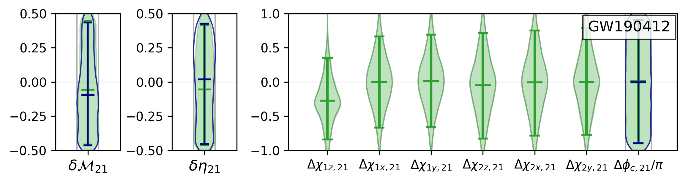
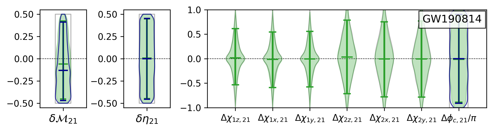

# Binary black hole spectroscopy: a toupee test of GW190814 and GW190412
**Collin D. Capano<sup>1,2</sup>, Alexander H. Nitz<sup>1,2</sup>**

 <sub>1. [Albert-Einstein-Institut, Max-Planck-Institut for Gravitationsphysik, D-30167 Hannover, Germany](http://www.aei.mpg.de/obs-rel-cos)</sub>  

 <sub>2. Leibniz Universitat Hannover, D-30167 Hannover, Germany</sub> 

This repository is a companion to [Capano and Nitz (arXiv:2008.02248)](https://arxiv.org/abs/2008.02248). It contains posterior probability density files from the parameter estimation analysis described in the paper and the configuration files needed to run the analysis. We also provide a jupyter a notebook for combining results between GW190814 and GW190412. We encourage use of these data in derivative works. If you use the material provided here, please cite the paper using the reference:
```
@article{Capano:2020dix,
    author = "Capano, Collin D. and Nitz, Alexander H.",
    title = "{Binary black hole spectroscopy: a toupee test of GW190814 and GW190412}",
    eprint = "2008.02248",
    archivePrefix = "arXiv",
    primaryClass = "gr-qc",
    month = "8",
    year = "2020"
}
```

## 21 results ##

In the paper we only showed results for the $\ell m = 33$ mode. The following violin plots are equivalent to Fig. 2 of the paper, but for the $\ell m = 21$ mode:





Green regions/lines are from the analysis in which we allow both the masses and spins to deviate. Dark blue lines show the same result when the sub-dominant mode spins are fixed to the dominant-mode value. Horizontal hashes indicate the median (center) and 90\% credible regions. Gray lines show the marginalized prior distributions. Since the prior distributions on the $\Delta \chi_{ik, \ell m}$ are dependent on the dominant-mode spins $\chi_{ik, 22}$, we show spin priors conditioned on the $\chi_{ik, 22}$ posteriors.

We see that we obtain negligible constraints from the 21 mode. This is expected, as the 33 mode was the only sub-dominant harmonic with appreciable SNR in both events.

## Posterior files ##

HDF files containing posterior samples for GW190412 and GW190814 may be found in the `posteriors` directory. The `posterior-all_params.hdf` file for each event contains the posterior samples from the analysis in which we allow the masses, phase, *and* spins measured by the sub-dominant harmonics to deviate from the dominant harmonic. The `posterior-mass_params.hdf` contains samples from the analysis in which we only allow phase and mass parameters to deviate.

Samples are stored as 1D arrays in the `samples` group in the posterior files. There is a separate dataset for each parameter that was varied in the analysis, along with a dataset for the log likelihood at that point. The parameters are:

  * `srcmass1`: the source-frame mass of the larger object, in solar masses.
  * `srcmass2`: the source-frame mass of the smaller object, in solar masses.
  * `spin1_a`: the magnitude of the dimensionless spin of the larger object.
  * `spin2_a`: "" smaller object.
  * `spin1_azimuthal`: the azimuthal angle of the dimensionless spin of the larger object.
  * `spin2_azimuthal`: "" smaller object.
  * `spin1_polar`: the polar angle of the dimensionless spin of the smaller object.
  * `spin2_polar`: "" smaller object.
  * `coa_phase`: the reference phase.
  * `ra`: the right ascension of the binary, in radians.
  * `dec`: the declination of the binary, in radians.
  * `comoving_volume`: the comoving volume (in Mpc^3^). To convert to luminosity distance we use standard Lambda-CDM cosmology, with values from the Planck 2015 results [Ade et al., Astron. Astrophys. 594, A13 (2016)](https://doi.org/10.1051/0004-6361/201525830).
  * `inclination`: the angle between the orbital angular momentum and the line of sight to the binary at the reference frequency (stored as `f_ref` in the file's `attrs`), in radians.
  * `polarization`: the polarization angle of the gravitational wave, in radians.
  * `delta_tc`: the difference between the measured coalescence time of the event and a reference GPS time, which is stored in the file's `attrs` as `trigger_time`.
  * `fdiff_33_mchirp`: the fractional difference in the chirp mass between the 33 mode and the dominant mode.
  * `fdiff_21_mchirp`: "" 21 mode "".
  * `fdiff_33_eta`: the fractional difference in the symmetric mass ratio between the 33 mode and the dominant mode.
  * `fdiff_21_eta`: "" 21 mode "".
  * `absdiff_33_coa_phase`: the difference in the reference phase between the 33 mode and the dominant mode.
  * `absdiff_21_coa_phase`: "" 21 mode ""
  * `spin1_33_a`: (*not in the `mass_params` files*) the magnitude of the dimensionless spin of the larger object, as measured by the 33 mode.
  * `spin1_21_a`: "" 21 mode.
  * `spin1_33_azimuthal`: (*not in the `mass_params` files*) the azimuthal angle of the dimensionless spin of the smaller object, as measured by the 33 mode.
  * `spin1_21_azimuthal`: "" 21 mode.
  * `spin1_33_polar`: (*not in the `mass_params` files*) the polar angle of the dimensionless spin of the smaller object, as measured by the 33 mode.
  * `spin1_21_polar`: "" 21 mode.
  * `spin2_33_a`: (*not in the `mass_params` files*) the magnitude of the dimensionless spin of the smaller object, as measured by the 33 mode.
  * `spin2_21_a`: "" 21 mode. 
  * `spin2_33_azimuthal`: (*not in the `mass_params` files*) the azimuthal angle of the dimensionless spin of the smaller object, as measured by the 33 mode.
  * `spin2_21_azimuthal`: "" 21 mode.
  * `spin2_33_polar`: (*not in the `mass_params` files*) the polar angle of the dimensionless spin of the smaller object, as measured by the 33 mode.
  * `spin2_21_polar`: "" 21 mode.
  * `loglikelihood`: the log of the likelihood at the given point.


## License ##


This work is licensed under a [Creative Commons Attribution-ShareAlike 3.0 United States License](http://creativecommons.org/licenses/by-sa/3.0/us/).
